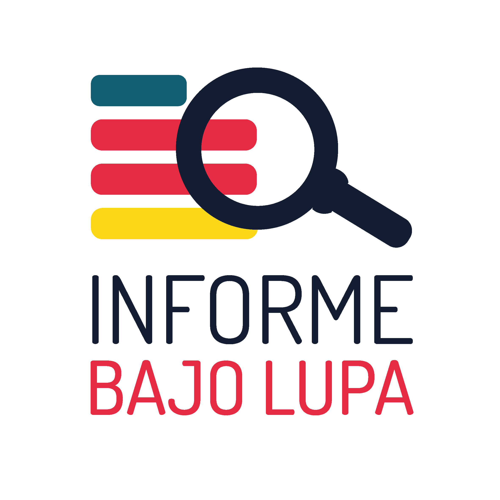

<div style="text-align:center"></div>

# Informe bajo lupa

Este es un pequeño proyecto que ayuda a visualizar los resultados del trabajo realizado para revisar los informes de gobierno de los acaldes de Guadalajara y Zapopan.

## Google Spreadsheets *"the ultimate back-end"*

Como dato curioso el proyecto obtiene la información de google spreadsheets y la muestra en el front-end usando [tabletop](https://github.com/jsoma/tabletop)


## Desarrollo

Necesitas tener instalado:

* [NodeJS](https://nodejs.org/en/)
* [GulpJS](http://gulpjs.com/)


Para ejecutar el proyecto de manera local ejecuta:

```
gulp
```
